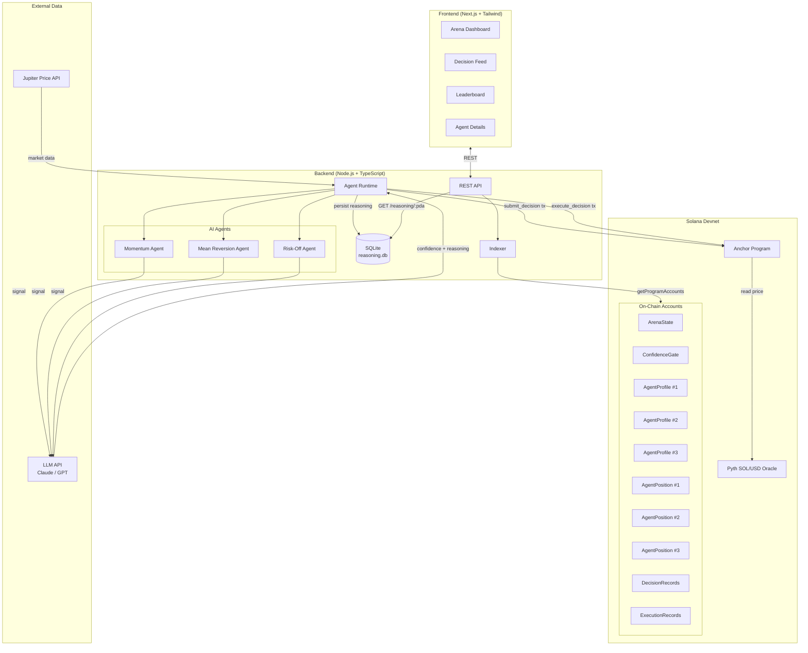
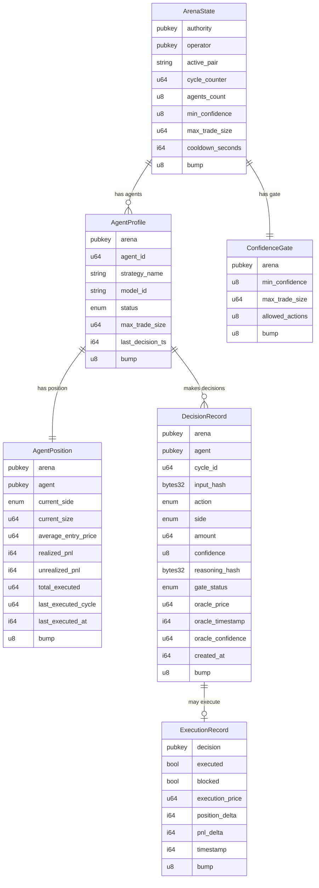
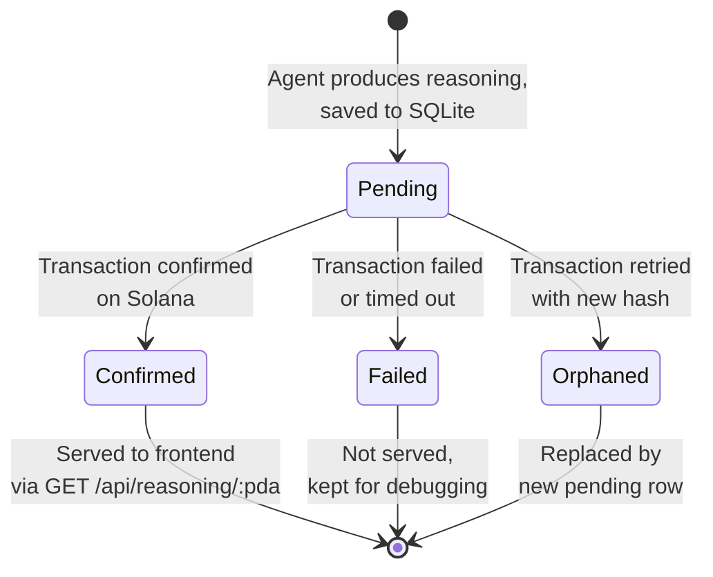
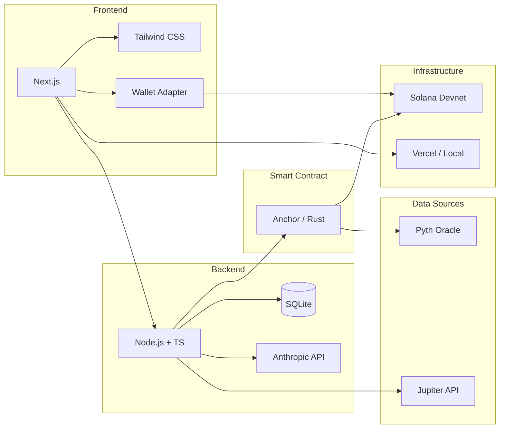

# AI Arena — Visual Architecture

---

## 1. System Overview



---

## 2. Decision Cycle Flow

```mermaid
sequenceDiagram
    participant MDS as Market Data Service
    participant RT as Agent Runtime
    participant DET as Deterministic Logic
    participant LLM as LLM (Claude/GPT)
    participant DB as SQLite
    participant SOL as Solana Program
    participant PYTH as Pyth Oracle
    participant IDX as Indexer
    participant UI as Frontend

    Note over RT: === Cycle N Start ===

    rect rgb(40, 40, 60)
        Note over RT,SOL: Phase 1: Record outcomes for Cycle N-1
        RT->>PYTH: get current oracle price
        RT->>SOL: record_outcome(cycle N-1 decisions)
        SOL->>SOL: update ExecutionRecord.pnl_delta
        SOL->>SOL: update AgentPosition.realized_pnl
    end

    rect rgb(40, 60, 40)
        Note over MDS,LLM: Phase 2: Generate decisions
        RT->>MDS: request snapshot(cycle_id=N)
        MDS->>MDS: fetch prices, compute indicators
        MDS-->>RT: snapshot {sma, momentum, volatility, cycle_id}

        par All agents in parallel
            RT->>DET: snapshot → Momentum strategy
            DET-->>RT: signal {action: buy, amount: 10}
            RT->>LLM: signal + context + persona
            LLM-->>RT: {confidence: 84, reasoning: "..."}
        and
            RT->>DET: snapshot → MeanReversion strategy
            DET-->>RT: signal {action: sell, amount: 5}
            RT->>LLM: signal + context + persona
            LLM-->>RT: {confidence: 42, reasoning: "..."}
        and
            RT->>DET: snapshot → RiskOff strategy
            DET-->>RT: signal {action: hold, amount: 0}
            RT->>LLM: signal + context + persona
            LLM-->>RT: {confidence: 91, reasoning: "..."}
        end
    end

    rect rgb(60, 40, 40)
        Note over DB,SOL: Phase 3: Submit decisions on-chain
        RT->>DB: INSERT reasoning (status: pending)

        loop For each agent
            RT->>SOL: submit_decision(action, confidence, reasoning_hash)
            SOL->>PYTH: read oracle price
            SOL->>SOL: create DecisionRecord
            SOL->>SOL: evaluate gate (confidence, limits, position, cooldown)
            SOL-->>RT: tx confirmed (gate_status)
            RT->>DB: UPDATE status = confirmed
        end
    end

    rect rgb(60, 60, 40)
        Note over RT,SOL: Phase 4: Execute approved decisions
        loop For each approved decision
            RT->>SOL: execute_decision(decision_pda)
            SOL->>SOL: create ExecutionRecord
            SOL->>SOL: update AgentPosition (size, entry_price, side)
            SOL-->>RT: tx confirmed
        end
    end

    rect rgb(40, 40, 40)
        Note over IDX,UI: Phase 5: Update UI
        IDX->>SOL: getProgramAccounts (poll)
        IDX->>IDX: compute leaderboard
        UI->>IDX: fetch updated state
        UI->>UI: render decision feed + leaderboard
    end
```



---

## 3. On-Chain Account Model



---

## 4. Gate Evaluation Logic

```mermaid
flowchart TD
    START([Agent submits decision]) --> RECORD[Create DecisionRecord on-chain]
    RECORD --> READ_PYTH[Read Pyth oracle price]
    READ_PYTH --> CHECK1{confidence >= min_confidence?}

    CHECK1 -->|No| BLOCKED1[gate_status = BlockedLowConfidence]
    CHECK1 -->|Yes| CHECK2{amount <= max_trade_size?}

    CHECK2 -->|No| BLOCKED2[gate_status = BlockedRiskLimit]
    CHECK2 -->|Yes| CHECK3{action in allowed_actions?}

    CHECK3 -->|No| BLOCKED3[gate_status = BlockedInvalidAction]
    CHECK3 -->|Yes| CHECK4{position + amount <= max_position?}

    CHECK4 -->|No| BLOCKED4[gate_status = BlockedPositionLimit]
    CHECK4 -->|Yes| CHECK5{cooldown elapsed?}

    CHECK5 -->|No| BLOCKED5[gate_status = BlockedCooldown]
    CHECK5 -->|Yes| APPROVED[gate_status = Approved]

    BLOCKED1 & BLOCKED2 & BLOCKED3 & BLOCKED4 & BLOCKED5 --> SAVED_BLOCKED[Decision saved on-chain as BLOCKED<br/>No execution]
    APPROVED --> EXECUTE[execute_decision called]
    EXECUTE --> UPDATE_POS[Update AgentPosition]
    UPDATE_POS --> CREATE_EXEC[Create ExecutionRecord]

    style APPROVED fill:#2d6a2d
    style BLOCKED1 fill:#6a2d2d
    style BLOCKED2 fill:#6a2d2d
    style BLOCKED3 fill:#6a2d2d
    style BLOCKED4 fill:#6a2d2d
    style BLOCKED5 fill:#6a2d2d
    style SAVED_BLOCKED fill:#4a3a2a
```



---

## 5. Pricing Model

```mermaid
flowchart LR
    subgraph OffChain["Off-Chain (what AI sees)"]
        JUPITER[Jupiter API] --> MDS[Market Data Service]
        MDS --> SNAPSHOT["Snapshot:<br/>SMA, momentum,<br/>volatility, cycle_id"]
        SNAPSHOT --> AGENTS[AI Agents]
        SNAPSHOT --> HASH["input_hash =<br/>SHA-256(snapshot)"]
    end

    subgraph OnChain["On-Chain (source of truth for PnL)"]
        PYTH_FEED[Pyth SOL/USD] --> SUBMIT["submit_decision reads:<br/>oracle_price<br/>oracle_timestamp<br/>oracle_confidence"]
        SUBMIT --> DR["DecisionRecord<br/>stores oracle price"]
        DR --> PNL["PnL = exit_oracle_price<br/>- entry_oracle_price"]
    end

    HASH -->|stored in DecisionRecord| DR
    AGENTS -->|confidence, reasoning| SUBMIT

    style OffChain fill:#1a1a2e
    style OnChain fill:#162447
```



---

## 6. Reasoning Storage Lifecycle



---

## 7. Frontend Layout

```
┌─────────────────────────────────────────────────────────────────────┐
│  AI Arena                                    [Connect Wallet]       │
├─────────────────────────────────────────────────────────────────────┤
│                                                                     │
│  ┌─────────────────┐ ┌─────────────────┐ ┌─────────────────┐      │
│  │ Momentum Agent  │ │ MeanRev Agent   │ │ Risk-Off Agent  │      │
│  │                 │ │                 │ │                 │      │
│  │ Status: Active  │ │ Status: Active  │ │ Status: Active  │      │
│  │ Position: Long  │ │ Position: Flat  │ │ Position: Long  │      │
│  │ Size: 15 SOL    │ │ Size: 0         │ │ Size: 3 SOL     │      │
│  │ PnL: +$12.40   │ │ PnL: -$2.10    │ │ PnL: +$1.80    │      │
│  │ Decisions: 24   │ │ Decisions: 24   │ │ Decisions: 24   │      │
│  │ Gate Pass: 75%  │ │ Gate Pass: 42%  │ │ Gate Pass: 88%  │      │
│  └─────────────────┘ └─────────────────┘ └─────────────────┘      │
│                                                                     │
│  [ Run Next Cycle ]                                                 │
│                                                                     │
│  ┌──────────────────────────────────────────────────────────────┐   │
│  │ Decision Feed                                                │   │
│  │                                                              │   │
│  │ Cycle #25  12:04:32                                          │   │
│  │                                                              │   │
│  │  Momentum    BUY 10 SOL   conf: 84                          │   │
│  │  [Gate: 84 >= 70 PASS] → [Executed @ $145.20] → [+$2.30]   │   │
│  │  View on Explorer ↗                                          │   │
│  │                                                              │   │
│  │  MeanRev     SELL 5 SOL   conf: 42                          │   │
│  │  [Gate: 42 >= 70 FAIL] → [Blocked: LowConfidence]          │   │
│  │  View on Explorer ↗                                          │   │
│  │                                                              │   │
│  │  Risk-Off    HOLD         conf: 91                          │   │
│  │  [Gate: 91 >= 70 PASS] → [No action (hold)]                │   │
│  │  View on Explorer ↗                                          │   │
│  │                                                              │   │
│  └──────────────────────────────────────────────────────────────┘   │
│                                                                     │
│  ┌──────────────────────────────────────────────────────────────┐   │
│  │ Leaderboard                                                  │   │
│  │                                                              │   │
│  │  #1  Risk-Off Agent     PnL: +$18.40   Pass: 88%   24 dec  │   │
│  │  #2  Momentum Agent     PnL: +$12.40   Pass: 75%   24 dec  │   │
│  │  #3  MeanRev Agent      PnL: -$2.10    Pass: 42%   24 dec  │   │
│  └──────────────────────────────────────────────────────────────┘   │
└─────────────────────────────────────────────────────────────────────┘
```

---

## 8. Tech Stack Map


